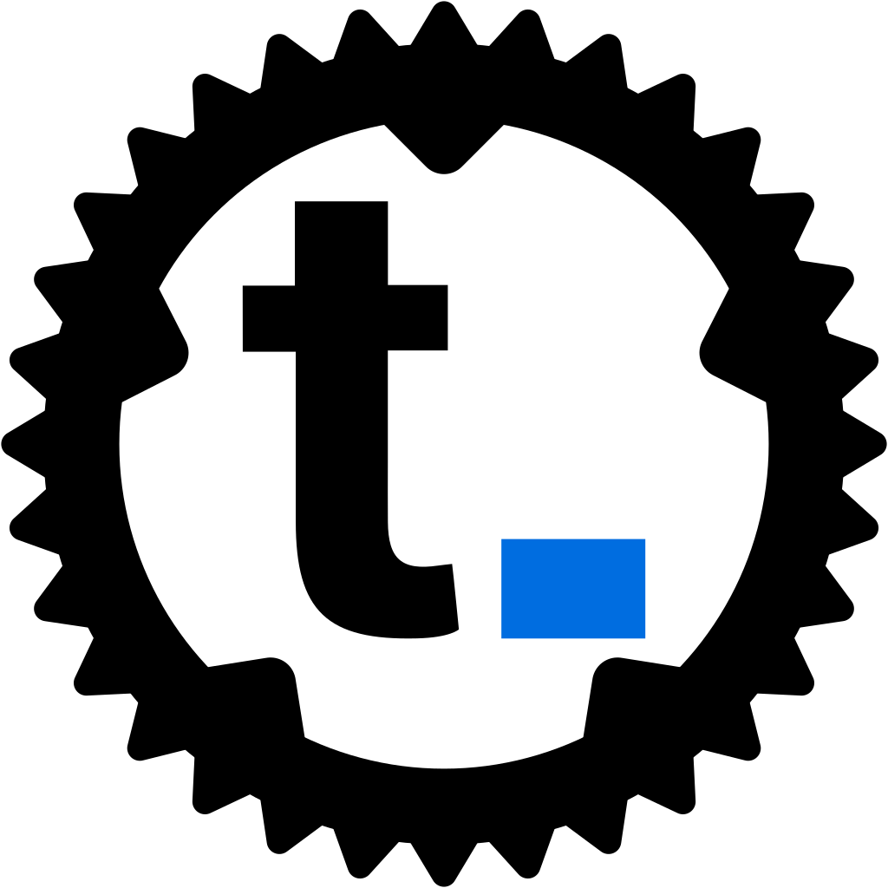

<center>
    
    <h1>Rust <a href="https://www.thumbor.org/">Thumbor</a> client</h1>
</center>

# 

[](https://crates.io/crates/thumbor)
[](https://docs.rs/thumbor)


## Usage

In short :

```rust
use thumbor::Server;

let url = Server::new("http://localhost:8888", "my-security-key")
    .unwrap()
    .settings_builder()
    .resize((300, 200))
    .smart(true)
    .build()
    .to_url("path/to/my/image.jpg");
```

```rust
use thumbor::Server;

let server = Server::new("http://localhost:8888", "my-security-key").unwrap();

let settings_builder = server.settings_builder()
    .resize((300, 200))
    .smart(true)
    .build();

let url = settings_builder.to_url("path/to/my/image.jpg");
```
